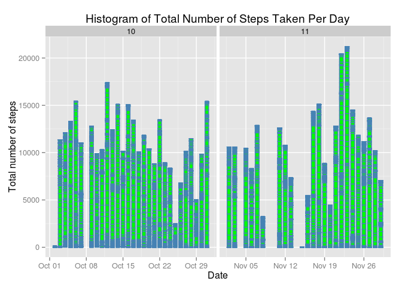
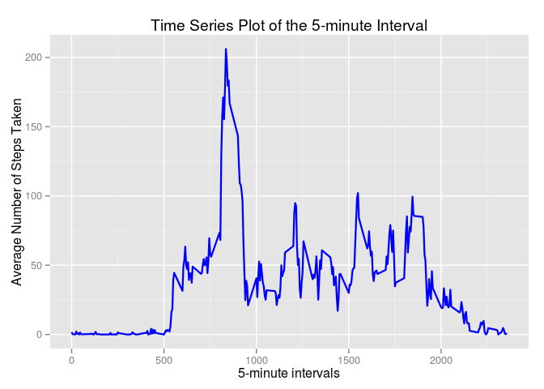
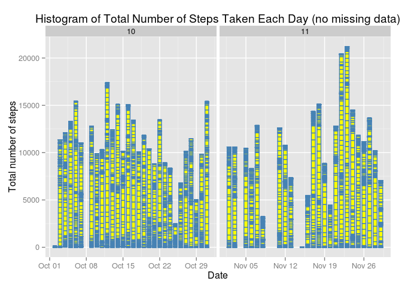
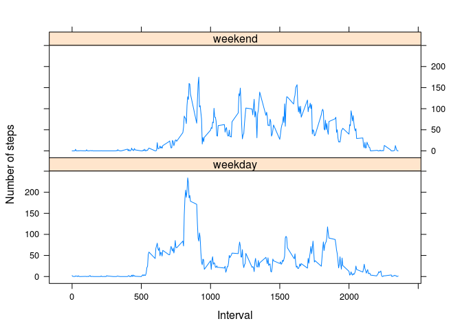

# Reproducible Research-033: Peer Assessment 1
==========================================
By Artis JIANG on 2015/10/14


### Global settings

```r
echo = TRUE  # Always make code visible
options(scipen = 1)  # Turn off scientific notations for numbers
```


## Loading and preprocessing the data

Show any code that is needed to

1.Load the data (i.e. read.csv())

```r
unzip("activity.zip")
data <- read.csv("activity.csv", colClasses = c("integer", "Date", "factor"))
```


2.Process/transform the data (if necessary) into a format suitable for your analysis

```r
data$month <- as.numeric( format(data$date, "%m") )
data_noNA <- na.omit(data)
rownames(data_noNA) <- 1:nrow(data_noNA)
head(data_noNA)
```

```
##   steps       date interval month
## 1     0 2012-10-02        0    10
## 2     0 2012-10-02        5    10
## 3     0 2012-10-02       10    10
## 4     0 2012-10-02       15    10
## 5     0 2012-10-02       20    10
## 6     0 2012-10-02       25    10
```

```r
dim(data_noNA)
```

```
## [1] 15264     4
```
<br><br><br>

<hr>
## What is mean total number of steps taken per day?
For this part of the assignment, you can ignore the missing values in the dataset.

1. Calculate the total number of steps taken per day 

```r
totalSteps <- aggregate(data_noNA$steps, list(Date = data_noNA$date), FUN = "sum")$x
head(totalSteps)
```

```
## [1]   126 11352 12116 13294 15420 11015
```

2. If you do not understand the difference between a histogram and a barplot, research the difference between them. Make a histogram of the total number of steps taken each day 

```r
library(ggplot2)

ggplot(data_noNA, aes(date, steps)) + geom_bar(stat="identity", colour="steelblue", fill="green", width=0.7)+ facet_grid(. ~ month, scales = "free") + labs(title = "Histogram of Total Number of Steps Taken Per Day", x = "Date", y = "Total number of steps")
```

 

3. Calculate and report the mean and median of the total number of steps taken per day 

```r
cat( sprintf("mean of the total number of steps taken per day = %9.0f steps\n", mean(totalSteps) ) )
```

```
## mean of the total number of steps taken per day =     10766 steps
```

```r
cat( sprintf("median of the total number of steps taken per day = %9.0f steps\n", median(totalSteps) ) )
```

```
## median of the total number of steps taken per day =     10765 steps
```
<br><br><br>

<hr>
## What is the average daily activity pattern?

1. Make a time series plot (i.e. type = "l") of the 5-minute interval (x-axis) and the average number of steps taken, averaged across all days (y-axis)


```r
avgSteps <- aggregate( data_noNA$steps, list(interval = as.numeric(as.character(data_noNA$interval))), FUN = "mean")
names(avgSteps)[2] <- "meanOfSteps"

ggplot( data=avgSteps, aes(interval, meanOfSteps)) + geom_line(color = "blue", size = 0.8) + labs(title = "Time Series Plot of the 5-minute Interval", x="5-minute intervals", y="Average Number of Steps Taken")
```

 

2. Which 5-minute interval, on average across all the days in the dataset, contains the maximum number of steps?

```r
avgSteps[ which.max( avgSteps$meanOfSteps ),  ]
```

```
##     interval meanOfSteps
## 104      835    206.1698
```

<br><br><br>


<hr>
## Imputing missing values
Note that there are a number of days/intervals where there are missing values (coded as NA). The presence of missing days may introduce bias into some calculations or summaries of the data.


1. Calculate and report the total number of missing values in the dataset (i.e. the total number of rows with NAs)

```r
sum( is.na(data) )
```

```
## [1] 2304
```

2. Devise a strategy for filling in all of the missing values in the dataset. The strategy does not need to be sophisticated. For example, you could use the mean/median for that day, or the mean for that 5-minute interval, etc.


```r
## Replace each missing value with the mean value of its 5-minute interval
newData <- data_noNA 
for (i in 1:nrow(newData)) {
    if (is.na(newData$steps[i])) {
        newData$steps[i] <- avgSteps[which(newData$interval[i] == avgSteps$interval), ]$meanOfSteps
    }
}
```

3. Create a new dataset that is equal to the original dataset but with the missing data filled in.

```r
head(newData)
```

```
##   steps       date interval month
## 1     0 2012-10-02        0    10
## 2     0 2012-10-02        5    10
## 3     0 2012-10-02       10    10
## 4     0 2012-10-02       15    10
## 5     0 2012-10-02       20    10
## 6     0 2012-10-02       25    10
```

4. Make a histogram of the total number of steps taken each day and Calculate and report the mean and median total number of steps taken per day. Do these values differ from the estimates from the first part of the assignment? What is the impact of imputing missing data on the estimates of the total daily number of steps?

```r
ggplot(newData, aes(date, steps)) + geom_bar(stat="identity", colour="steelblue", fill="yellow", width=0.7) + facet_grid(. ~ month, scales = "free") + labs(title = "Histogram of Total Number of Steps Taken Each Day (no missing data)", x = "Date", y = "Total number of steps")
```

 

- Mean of total number of steps taken per day:

```r
newTotalSteps <- aggregate(newData$steps, list(Date = newData$date), FUN = "sum")$x
new_mean <- mean(newTotalSteps)
new_mean
```

```
## [1] 10766.19
```

- Median of total number of steps taken per day:

```r
new_median <- median(newTotalSteps)
new_median
```

```
## [1] 10765
```

- Compare them with the two prior imputing missing data:

```r
old_mean <- mean(totalSteps)
old_median <- median(totalSteps)
new_mean - old_mean
```

```
## [1] 0
```

```r
new_median - old_median
```

```
## [1] 0
```

Per above comparison, after imputing the missing data, the new mean of total steps taken per day is the same as that of the old mean; the new median of total steps taken per day is greater than that of the old median.

<br><br><br>


<hr>
## Are there differences in activity patterns between weekdays and weekends?

For this part the weekdays() function may be of some help here. Use the dataset with the filled-in missing values for this part.

1. Create a new factor variable in the dataset with two levels – “weekday” and “weekend” indicating whether a given date is a weekday or weekend day.

First, let's find the day of the week for each measurement in the dataset. In this part, we use the dataset with the filled-in values.


```r
head(newData)
```

```
##   steps       date interval month
## 1     0 2012-10-02        0    10
## 2     0 2012-10-02        5    10
## 3     0 2012-10-02       10    10
## 4     0 2012-10-02       15    10
## 5     0 2012-10-02       20    10
## 6     0 2012-10-02       25    10
```

```r
newData$weekdays <- factor(format(newData$date, "%A"))
levels(newData$weekdays)
```

```
## [1] "Friday"    "Monday"    "Saturday"  "Sunday"    "Thursday"  "Tuesday"  
## [7] "Wednesday"
```

```r
levels(newData$weekdays) <- list(weekday = c("Monday", 
											 "Tuesday",
                                             "Wednesday", 
                                             "Thursday", 
											 "Friday"),
                                 weekend = c("Saturday", 
                                 			 "Sunday"	))
levels(newData$weekdays)
```

```
## [1] "weekday" "weekend"
```

```r
table(newData$weekdays)
```

```
## 
## weekday weekend 
##   11232    4032
```


2. Make a panel plot containing a time series plot (i.e. type = "l") of the 5-minute interval (x-axis) and the average number of steps taken, averaged across all weekday days or weekend days (y-axis). See the README file in the GitHub repository to see an example of what this plot should look like using simulated data.

Now, let's make a panel plot containing plots of average number of steps taken on weekdays and weekends.

```r
avgSteps <- aggregate( newData$steps, 
                       list(interval = as.numeric(as.character(newData$interval)), weekdays=newData$weekdays),
                       FUN = "mean")
names(avgSteps)[3] <- "meanOfSteps"
library(lattice)
xyplot( avgSteps$meanOfSteps ~ avgSteps$interval | avgSteps$weekdays, 
        layout=c(1, 2), type="l", xlab="Interval", ylab="Number of steps" )
```

 
